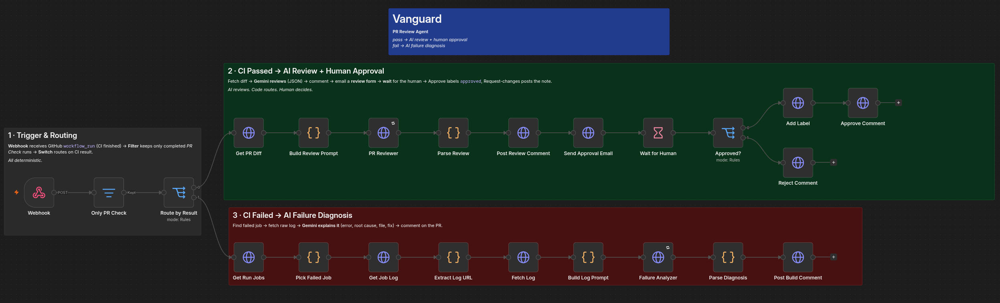
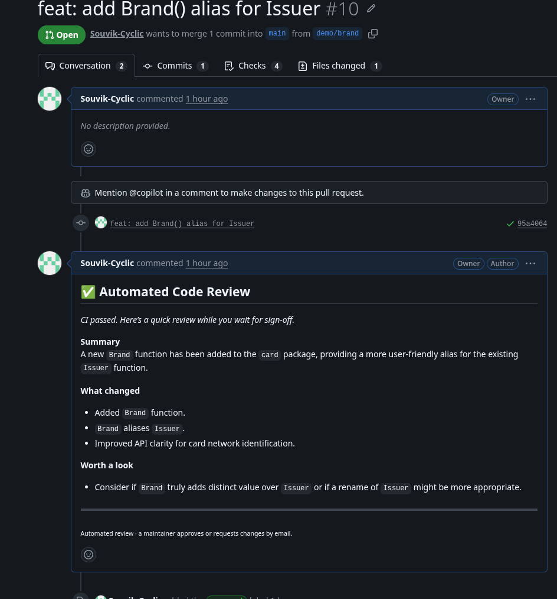
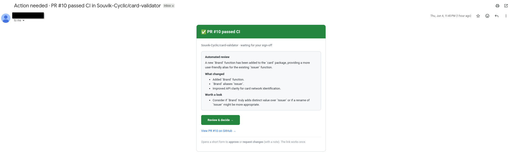
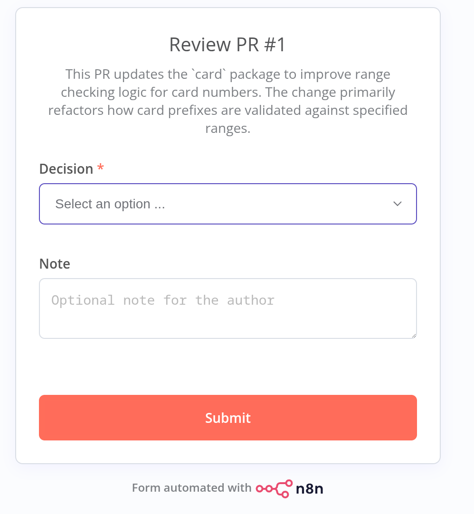
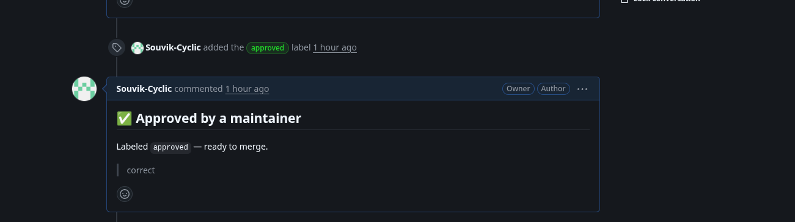
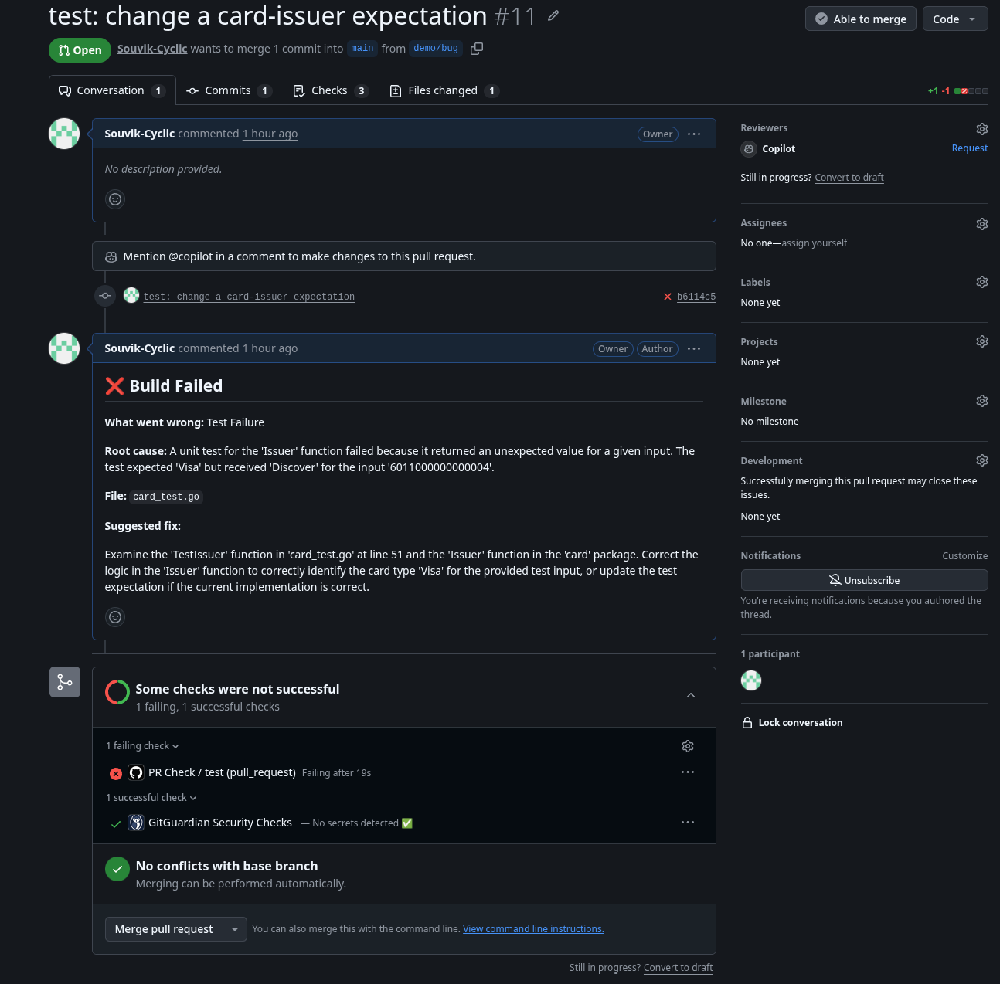

# Vanguard

> An agentic n8n workflow that **automatically reviews every pull request** — AI reviews the code,
> a human approves the merge.

**[Watch the demo](https://drive.google.com/file/d/1auTtSSUyaiRIgqbb_oFR_2A1ypFp3CTW/view?usp=sharing)** ·
[How it works](docs/WORKFLOW-EXPLANATION.md) ·
[Setup](docs/SETUP.md) ·
[Demo repo](https://github.com/Souvik-Cyclic/card-validator)

Vanguard reacts to a pull request's **CI result**:

- **CI passes** → an AI **reviewer** reads the diff and posts a short review, then emails a
  maintainer a one-click **Approve / Request-changes** form. Approving labels the PR `approved`;
  requesting changes posts the maintainer's note.
- **CI fails** → an AI **failure analyzer** reads the build log and comments the **error type,
  root cause, likely file, and a suggested fix** on the PR.

> AI is used only for reasoning — reviewing a diff, explaining a log. All routing, parsing, and
> control is **deterministic**, and a **human makes the merge decision**.

---

## How it works

```
GitHub Webhook (workflow_run = CI finished)
   → Filter: only completed "PR Check" runs          [deterministic]
   → Switch on CI result                              [deterministic]
        ├ success → Get diff → AI Reviewer (JSON) → comment
        │            → email review form → WAIT for human → approve = label / reject = note
        └ failure → find job → fetch log → AI Failure Analyzer (JSON) → comment
```

Two AI agents, the rest deterministic, a human in the loop. Full node-by-node breakdown:
**[docs/WORKFLOW-EXPLANATION.md](docs/WORKFLOW-EXPLANATION.md)**.

**Agentic practices:** two agent roles · structured JSON output · tool use (GitHub API,
Google Gemini 2.5 Flash, email) · routing on event/result/decision · deterministic control ·
human-in-the-loop approval · fallback handling.

---

## Screenshots

| | |
|---|---|
| **The workflow in n8n** | |
|  | |
| **CI passed → review comment** | **Approval email** |
|  |  |
| **Approve / Request-changes form** | **Approved → label + comment** |
|  |  |
| **CI failed → diagnosis** | |
|  | |

---

## Run it yourself

Self-hosted n8n (n8n Cloud doesn't expose custom env vars):

```bash
cp .env.example .env          # fill in the non-secret config
docker compose up -d          # starts n8n + a cloudflared tunnel
```

…then import the workflow, add two credentials (GitHub PAT + Gemini key), and point a GitHub
webhook at it. **Full step-by-step guide → [docs/SETUP.md](docs/SETUP.md).**

Config and secrets live in **different places**:

| | Where | What |
|---|-------|------|
| Non-secret config | `.env` / `docker-compose.yml` | `GEMINI_URL`, `EMAIL_SERVER_URL`, `REVIEWER_EMAIL`, public URL |
| **Secrets** | **n8n Credentials UI** (encrypted) | **GitHub PAT**, **Gemini key** |

---

## Repository layout

| Path | What |
|------|------|
| `workflow/vanguard.workflow.json` | the exported n8n workflow (import-ready) |
| `docker-compose.yml` · `.env.example` | self-host n8n (official image + tunnel) |
| `docs/PROBLEM-STATEMENT.md` | user · pain point · goal · output |
| `docs/WORKFLOW-EXPLANATION.md` | steps · AI nodes · deterministic nodes · branches · output |
| `docs/SETUP.md` | full run-it-yourself guide |
| `samples/` | a sample webhook input + the two AI JSON outputs |
| `screenshots/` | canvas · PR comments · email · form |

### About the samples
The [`samples/`](samples/) files document the input/output **shapes** — they are for reference, not
a runnable test (they point at this project's repo + credentials). To run the workflow, swap in
your own repo, PR, and credentials (see [docs/SETUP.md](docs/SETUP.md)).

- **`input-workflow_run.json`** — trimmed GitHub `workflow_run` webhook payload (the fields read).
  GitHub sends this; in n8n the Webhook node nests it under `body`, so expressions read
  `body.workflow_run.…`, `body.repository.full_name`, etc.
- **`output-review.json`** — JSON the **PR Reviewer** returns for a passing PR.
- **`output-failure.json`** — JSON the **Failure Analyzer** returns for a failing PR.

---

## Limitations & next steps

- **Reviews once per CI run** — reacts to the CI result, not every push mid-PR.
- **Large PRs are truncated** — the diff and log are capped before the model; chunking would handle
  very large changes.
- **Single approver** — the email goes to one maintainer; routing to code owners is the next step.
- **Webhook hardening** — for production, verify GitHub's HMAC signature and validate the incoming
  `repository`/`pr` values (allowlist) so only trusted events are processed.
- **Ephemeral tunnel** — the demo uses a quick cloudflared tunnel (URL changes on restart); a named
  tunnel or fixed domain makes it stable.
- **Could add:** inline line-level comments, Slack approval, and PR history across pushes.

---

## Tech

n8n · **Google Gemini 2.5 Flash** (the two AI steps) · GitHub REST API · an email service for the
approval form. Endpoints and the reviewer address are referenced through n8n environment variables;
**no secrets are stored in the exported JSON.**
